# Architecture Styles

ARSW Lab - Distributed Architecture Styles with Java

This repository contains the work developed for the ARSW architecture styles laboratory.

The main idea of the lab was to take simple distributed systems and implement them using different communication and architecture styles, starting from low-level TCP sockets and evolving into HTTP, RMI, gRPC, microservices, and an API Gateway.

The first two parts include both the guided movie example and the applied classroom exercise.

From the RMI section onward, the implementation focuses mainly on the applied exercises.

## What this lab covers

The lab explores different ways of building distributed applications:

- TCP sockets
- HTTP with Java HttpServer
- Java RMI
- gRPC with Protocol Buffers
- Microservices
- API Gateway

Each part helped me understand a different way of communication between client and server, and also the trade-offs between simplicity, interoperability, contracts, and service separation.

## 1. TCP Sockets

In this first part, the communication was done using raw TCP sockets.

The client sends a text message to the server, and the server processes it manually.

### Movie example

The movie example used a simple TCP protocol to request movie information by ID.

### Classroom exercise

For the applied exercise, I implemented a classroom reservation system.

The client can check, reserve, and release classrooms.

This part was useful to understand that with sockets we have full control, but we also have to define the communication protocol manually.

## 2. HTTP Architecture

In this part, the classroom system was adapted to HTTP.

Instead of sending custom text commands, the operations were exposed through routes and HTTP methods.

### Movie HTTP example

The movie example was exposed using a simple HTTP server in Java.

### Classroom HTTP exercise

The classroom system was implemented with routes such as:

- GET /rooms
- GET /rooms?id=E303
- POST /rooms/reserve?id=E303
- POST /rooms/release?id=E303

Evidence:

This part showed how HTTP gives a more standard way to interact with a service, using paths, methods, query parameters, and responses.

## 3. Java RMI

For the RMI exercise, I implemented a laboratory equipment inventory system.

The idea was to stop using manual text protocols and instead expose remote methods through a Java interface.

The system allows operations such as:

- List equipment
- Check equipment information
- Reserve equipment
- Release equipment

Evidence:

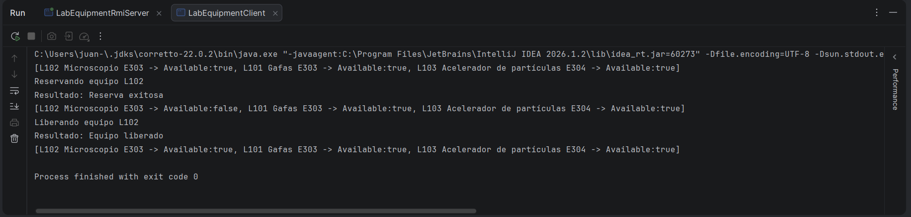

This part helped me understand RPC-style communication, where the client calls methods on a remote object. The main limitation is that RMI is strongly tied to Java.

## 4. gRPC

In the gRPC exercise, I implemented a university wellness appointment system.

The service uses a .proto file to define the contract between client and server.

The contract includes operations to:

- Request an appointment
- Cancel an appointment
- Get appointments by student

Evidence:

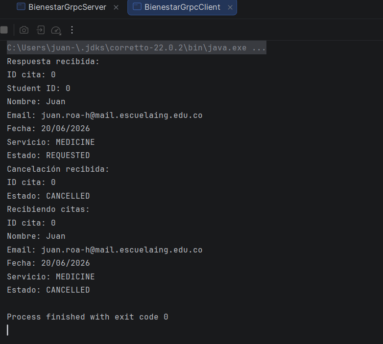

This part was useful because gRPC gives a formal contract through Protocol Buffers. It also generates classes automatically and makes the communication more structured than plain HTTP or sockets.

## 5. Microservices

For the microservices part, I decomposed the wellness system into smaller services with different responsibilities.

The implemented services were:

- AppointmentService: manages wellness appointments.
- GymService: manages gym session reservations.

Each service runs independently on a different port and has its own gRPC contract.

Evidence:

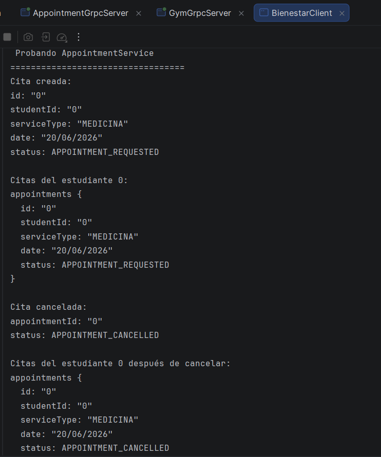

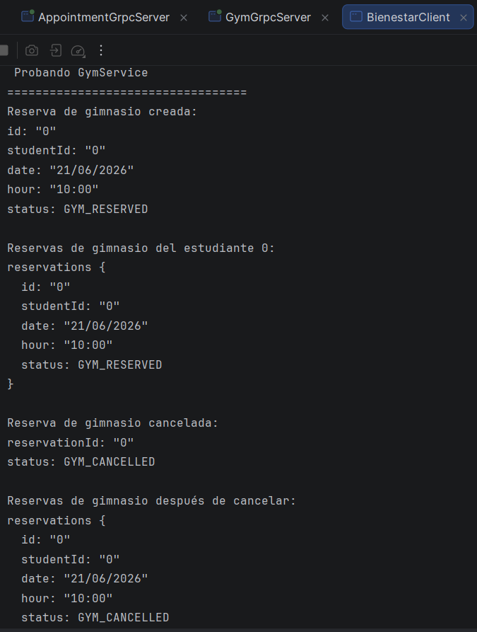

This part helped me understand that microservices are not just about creating many services, but about separating responsibilities clearly.

## 6. API Gateway

Finally, I implemented a simple WellnessGateway.

The gateway works as a single entry point for the client.

Instead of making the client connect directly to every service, the gateway communicates internally with the available services.

Implemented gateway operations include:

- Request an appointment
- Reserve a gym session

Some other operations were left as pending implementation, but the structure shows how the gateway would centralize access to the system.

Evidence:

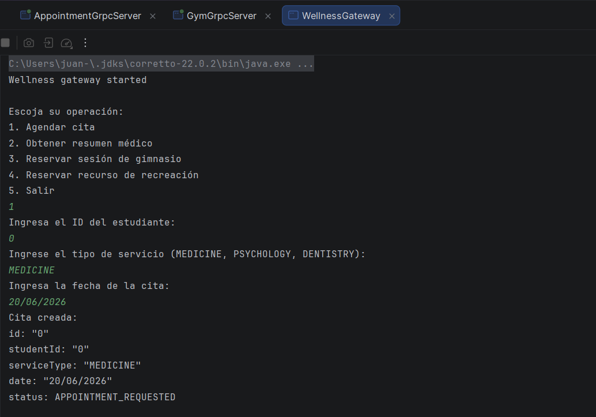

This part showed the main purpose of an API Gateway: reducing the coupling between the client and the internal microservices.

## 7. Final Integrator Exercise - ECICIENCIA Platform

For the final exercise, I designed a distributed architecture for the ECICIENCIA event platform.

The goal of this part was not to implement a very large system, but to propose a clear microservice-based solution using the architecture styles studied during the lab.

The platform supports basic operations such as:

- Register attendees
- Consult the event agenda
- Consult activities by time slot
- Book a spot in an activity or workshop
- Control the capacity of activities

For this exercise, I decided to keep the architecture simple and avoid creating too many services without a clear reason.

The implemented microservices were:

- ActivityService: manages the agenda, activities, schedules, activity types, locations, and capacity.
- RegistrationService: manages attendee registration and activity bookings.

A simple gateway was also implemented to centralize the access from the client.

The final structure is:

- EcicienciaClient: shows the menu and reads user input.
- EcicienciaGateway: connects to the internal services and hides their details from the client.
- ActivityService: runs on port 50051.
- RegistrationService: runs on port 50052.

Architecture Diagram:

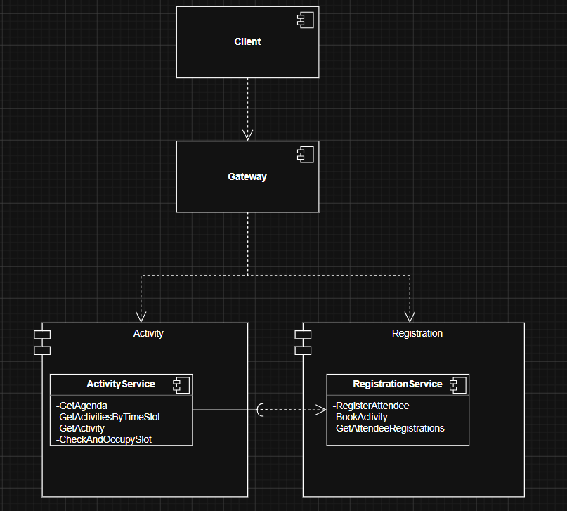

The client does not connect directly to the microservices. Instead, it uses the gateway, and the gateway communicates with the services.

The main operations implemented were:

- Register an attendee
- Get the full agenda
- Get activities by time slot
- Get activity information by ID
- Book an activity
- Get the activities booked by an attendee

Evidence:

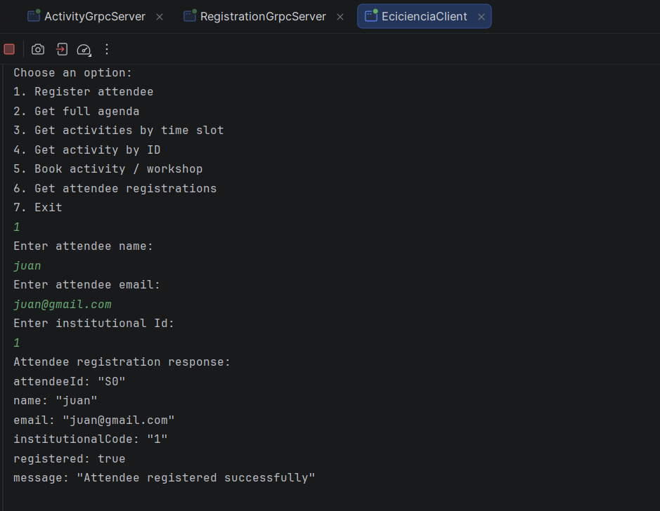

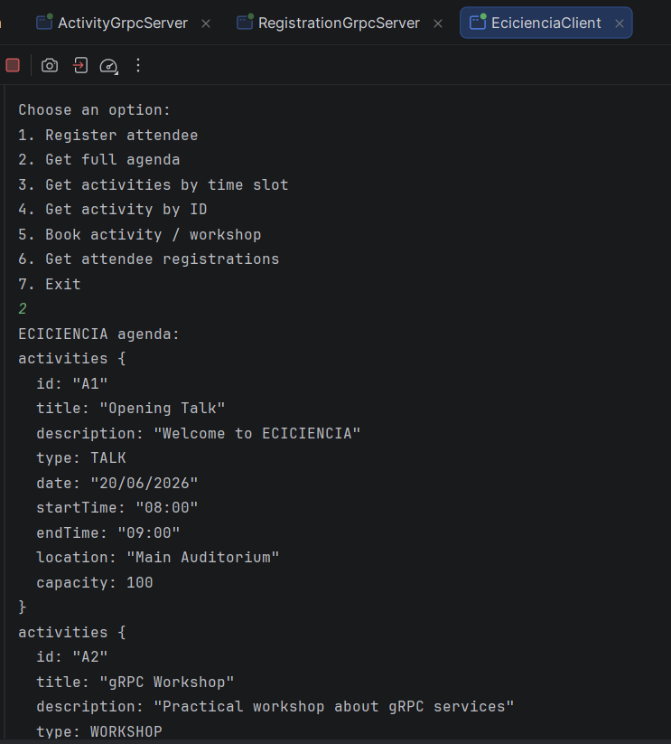

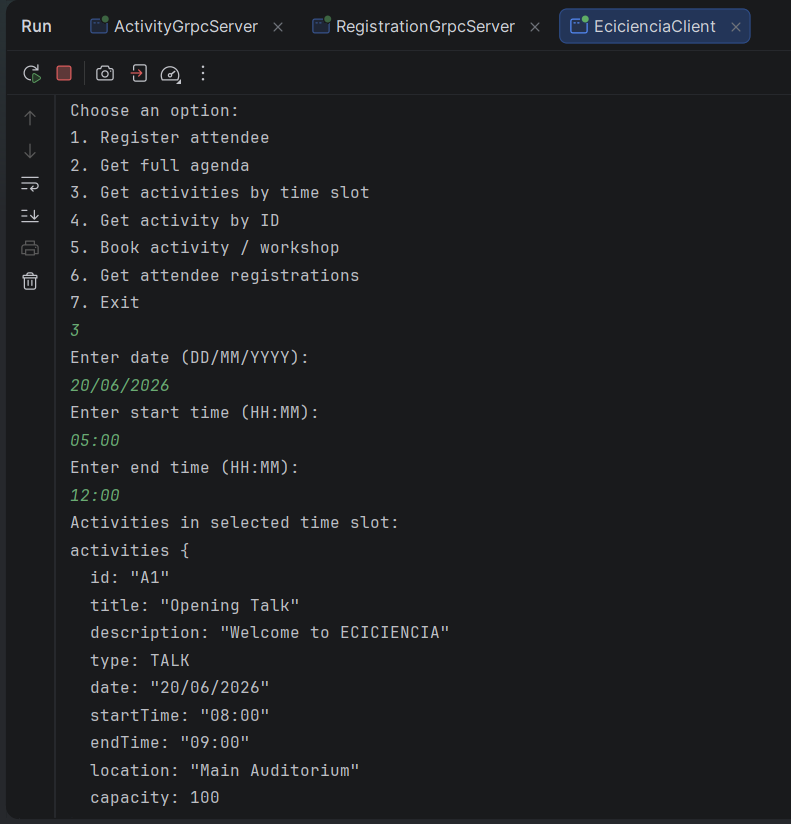

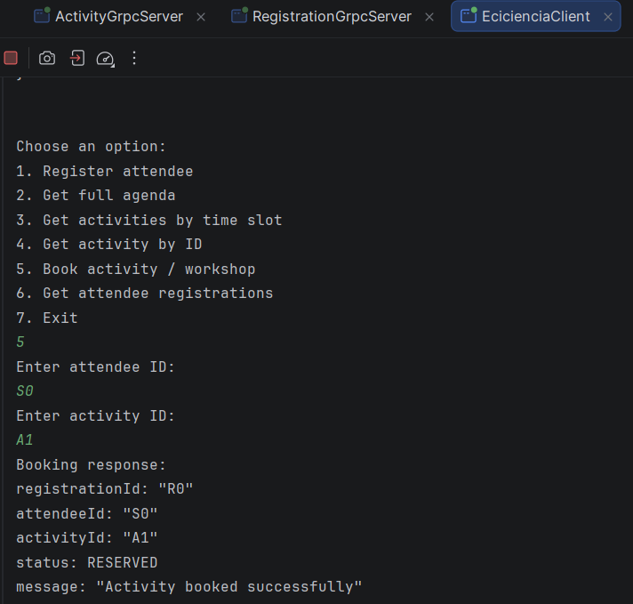

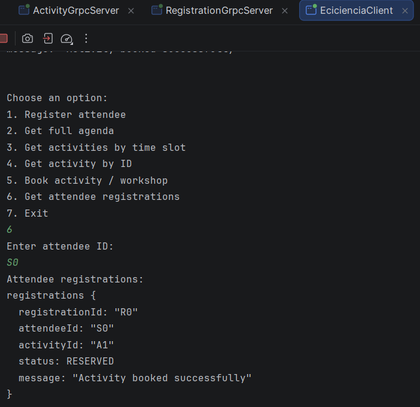

This final exercise helped me understand that microservices should not be separated just for the sake of having many services. In this case, two services were enough to represent the main responsibilities of the system.

ActivityService owns the event activities and their capacity, while RegistrationService owns attendees and bookings. This keeps the system understandable and avoids unnecessary communication between many services.

The Gateway also helps reduce coupling because the client does not need to know the ports or internal contracts of each service.

## Reflection Questions

### TCP Sockets - Classroom System

**How easy would it be to add a new operation to the protocol?**

It would be possible, but not very clean. Since the protocol is based on manually written text commands, every new operation requires changing both the client and the server. For example, if I wanted to add a new command like LISTAR_SALONES, I would have to define the exact text format, update the server validation, and also update the client to send that command correctly.

**What happens if two clients try to reserve the same classroom at the same time?**

There could be a race condition. If both clients check the classroom state before one of them updates it, both could think the classroom is available. To avoid this, the reservation operation should be synchronized or protected so only one client can reserve the same classroom at a time.

**Where is the communication contract really defined: in a formal file or in text conventions?**

The contract is defined only by text conventions. There is no formal file that describes the protocol. The client and server must agree manually on commands like CONSULTAR_SALON,E303 or RESERVAR_SALON,E303.

---

### HTTP - Classroom System

**What advantages does HTTP offer compared to a manually defined text protocol?**

HTTP gives a more standard structure for communication. Instead of inventing commands manually, the system can use methods, paths, query parameters, and response codes. It is also easier to test with tools like Postman, curl, or a browser.

**What limitations does building an HTTP server without a framework have?**

Without a framework, many things must be handled manually, such as routing, query parameters, response headers, status codes, and error handling. This is useful for learning, but it can become difficult to maintain if the application grows.

**How would this solution change if JSON were used instead of HTML?**

Using JSON would make the service easier to consume from other applications. Instead of returning text or HTML for humans, the server would return structured data that could be used by web clients, mobile apps, or other services.

---

### Java RMI - Laboratory Inventory

**What changed when moving from HTTP to RMI?**

The communication changed from routes and HTTP requests to remote method calls. With RMI, the client calls methods from a remote Java object, so the interaction feels closer to calling a normal Java interface.

**Where is the communication contract defined?**

The contract is defined in the remote Java interface. The methods available to the client, their parameters, and their return types are described in that interface.

**What problems would this system have if a client is not written in Java?**

The main problem is interoperability. RMI is strongly tied to Java, so a client written in another language would have difficulty consuming the service directly.

---

### gRPC - Wellness Appointment System

**Why is the .proto file considered a contract?**

The .proto file is considered a contract because it defines the services, methods, request messages, response messages, and data types used between the client and the server. Both sides must follow that definition.

**How easy would it be to create a client in another language?**

It would be easier than with RMI because gRPC supports multiple languages. As long as the client has the same .proto file, it can generate the required classes and communicate with the service.

**What differences do you find between RMI and gRPC?**

RMI is based on Java remote interfaces and works mainly inside the Java ecosystem. gRPC uses Protocol Buffers and .proto files, which makes the contract more formal and allows clients and servers to be implemented in different programming languages.

---

### Microservices - Wellness System

**Why did you decide to separate those services and not others?**

I separated the wellness system into AppointmentService and GymService because they represent different responsibilities. Appointments and gym reservations have different rules and data, so keeping them separate makes the design clearer without creating too many services.

**What data belongs to each service?**

AppointmentService owns the appointment data, such as appointment ID, student ID, service type, date, and status.

GymService owns the gym reservation data, such as reservation ID, student ID, date, hour, and reservation status.

**What risk appears when the client knows all the services?**

The client becomes coupled to the internal architecture. It needs to know the ports, addresses, and contracts of every service. If a service changes location or port, the client must also change.

---

### API Gateway - Wellness Gateway

**What does the Gateway simplify for the client?**

The Gateway gives the client a single entry point. The client does not need to know the address or port of each internal service. It only interacts with the Gateway.

**What complexity does it add to the system?**

The Gateway adds another component that must be maintained. It also needs to communicate with internal services and handle possible errors from them. If it is not designed carefully, it can become a central point of failure.

**What would happen if the Gateway starts containing too much business logic?**

If the Gateway contains too much business logic, it can become a monolith in the middle of the system. The services would lose responsibility, and the Gateway would become harder to maintain and change.

---

### Final Integrator Exercise - ECICIENCIA Platform

**Why not use a single monolithic service for everything?**

A single monolithic service would be easier to implement at the beginning, but it would mix different responsibilities in the same place. The system would have to manage agenda information, attendees, bookings, and capacity in one component.

For the final design, I separated the platform into ActivityService and RegistrationService. This keeps the architecture simple while still separating the most important responsibilities.

ActivityService manages the agenda, activities, schedules, activity types, locations, and capacity.

RegistrationService manages attendees and activity bookings.

This separation avoids creating too many microservices without a clear reason, but still makes the system easier to understand and evolve.

**What role does the Gateway play in the ECICIENCIA platform?**

The Gateway acts as the entry point for the client. The client uses the Gateway instead of connecting directly to ActivityService and RegistrationService. This reduces coupling because the client does not need to know the internal ports or service details.

**What is the main trade-off of this architecture?**

The main advantage is that responsibilities are clearer and the client is less coupled to the internal services. The main disadvantage is that the system becomes more complex than a single application because it has multiple services, gRPC contracts, and communication between components.

## General reflection

This lab shows how distributed architectures evolve depending on the problem being solved.

With TCP sockets, the communication is very manual.

With HTTP, the communication becomes more standard and easier to test.

With RMI, the system works through remote method calls, but mainly inside the Java ecosystem.

With gRPC, the communication is based on formal contracts and can work across different languages.

With microservices, the system is divided into smaller responsibilities.

Finally, with an API Gateway, the client gets a single access point instead of knowing every internal service.

Overall, the lab helped me understand that each architecture style has advantages and limitations. There is no single best option for every case; the decision depends on the size of the system, the type of clients, the need for interoperability, and how responsibilities are divided.